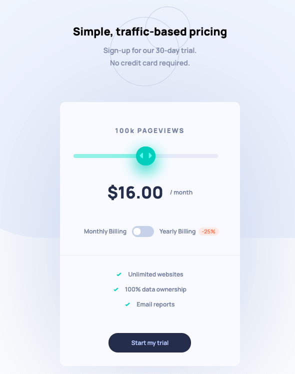

# Interactive pricing component solution

### The challenge

Users should be able to:

- View the optimal layout for the app depending on their device's screen size
- See hover states for all interactive elements on the page
- Use the slider and toggle to see prices for different page view numbers

### Screenshot

mobile (iphone x)        |  desktop 1440
:-------------------------:|:-------------------------:
 |  

### Links

- Solution URL: [Live Site](https://tristansetha.github.io/interactive-pricing-component-main)

## My process

### Built with

- Semantic HTML5 markup
- Sass 
- Flexbox
- CSS Grid
- Mobile-first workflow

### What I learned
Styling input range for chrome browser   
** Haven't tested cross browser   
CSS grid properties for reordering

### Continued development

Readable Sass
### Useful resources

- [How to style range input with CSS and JavaScript for better usability](https://tippingpoint.dev/style-range-input-css) 

## Author

tristansetha@gmail.com

